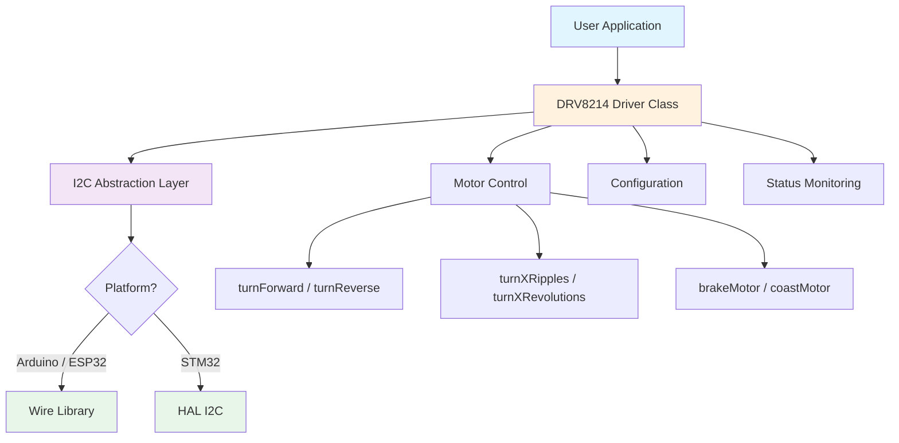
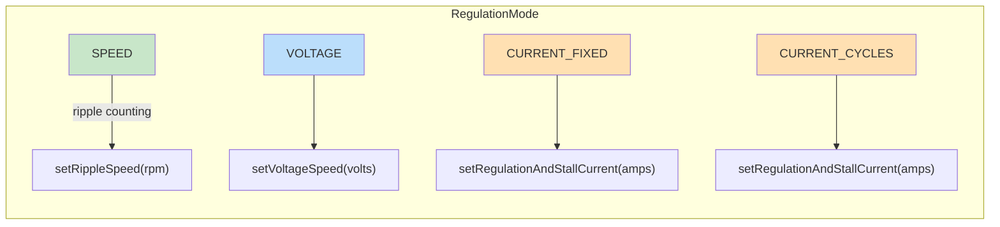

# DRV8214 Multiplatform Library

[](LICENSE.txt)
[](https://github.com/theohg/drv8214_multiplatform/releases)
[](https://github.com/theohg/drv8214_multiplatform/actions)


A C++ library for controlling the **[DRV8214](https://www.ti.com/product/DRV8214)** brushed DC motor driver from Texas Instruments via I2C. Supports Arduino, ESP32, and STM32 platforms with compile-time platform detection.

## Features

- **Multi-platform**: Single codebase for Arduino/ESP32 (Wire) and STM32 (HAL)
- **Regulation modes**: Speed (ripple counting), voltage, fixed current, cycle-by-cycle current
- **Motion control**: `turnForward`, `turnReverse`, `turnXRipples`, `turnXRevolutions`, `brakeMotor`, `coastMotor`
- **Sensorless position**: Ripple-counting with configurable thresholds and auto-stop
- **Monitoring**: Motor voltage, current, speed (RPM/rad/s), duty cycle, fault status
- **Protection**: Stall detection, overcurrent (OCP), overvoltage (OVP), thermal shutdown (TSD)

## Architecture



```
include/
├── drv8214.h                 # Driver class, registers, bit masks, config struct
├── drv8214_platform_config.h # Compile-time platform detection
└── drv8214_platform_i2c.h    # Platform-agnostic I2C function declarations
src/
├── drv8214.cpp               # Driver implementation
└── drv8214_platform_i2c.cpp  # Arduino (Wire) and STM32 (HAL) I2C implementations
```

## Installation

### PlatformIO

Add to your `platformio.ini`:

```ini
lib_deps =
    https://github.com/theohg/drv8214_multiplatform.git#v1.0.0
```

### Arduino IDE

1. Download or clone this repository
2. Copy into your Arduino `libraries/` folder
3. Restart the Arduino IDE

### STM32 (CubeMX / HAL)

1. Copy `include/` and `src/` into your project
2. The HAL header is auto-detected from your STM32 family define (e.g. `STM32F4xx`). If auto-detection fails, add `-DDRV8214_STM32_HAL_HEADER='"stm32f4xx_hal.h"'` to your build flags
3. Call `drv8214_i2c_set_handle(&hi2c1)` once in your initialization code before using the driver

## Quick Start

### Arduino / ESP32

```cpp
#include <Wire.h>
#include <drv8214.h>

// Hardware parameters
#define I2C_ADDR          DRV8214_I2C_ADDR_00  // 0x30 (7-bit)
#define SENSE_RESISTOR    1000   // IPROPI resistor [Ohms]
#define RIPPLES_PER_REV   6      // Current ripples per rotor revolution
#define MOTOR_RESISTANCE  12     // Winding resistance [Ohms]
#define REDUCTION_RATIO   298    // Gearbox ratio
#define MAX_RPM           100    // Max motor RPM

DRV8214 motor(I2C_ADDR, 0, SENSE_RESISTOR, RIPPLES_PER_REV,
              MOTOR_RESISTANCE, REDUCTION_RATIO, MAX_RPM);

void setup() {
    Serial.begin(115200);
    Wire.begin();

    motor.setDebugStream(&Serial);

    // Configure with defaults (PWM mode, speed regulation, stall detection on)
    DRV8214_Config cfg;
    cfg.verbose = true;
    motor.init(cfg);
}

void loop() {
    // Turn forward for 5000 ripples, then stop
    motor.turnXRipples(5000, true, true);
    delay(3000);

    // Read status
    Serial.print("Speed: ");
    Serial.print(motor.getMotorSpeedShaftRPM());
    Serial.println(" RPM");

    Serial.print("Current: ");
    Serial.print(motor.getMotorCurrent());
    Serial.println(" A");

    motor.printFaultStatus();

    // Turn reverse for 2 full shaft revolutions
    motor.turnXRevolutions(2, true, false);
    delay(3000);

    motor.brakeMotor();
    delay(2000);
}
```

### STM32

```c
// In main.c, after MX_I2C1_Init():
#include "drv8214.h"

drv8214_i2c_set_handle(&hi2c1);  // Required before any DRV8214 operation

DRV8214 motor(DRV8214_I2C_ADDR_00, 0, 1000, 6, 12, 298, 100);
DRV8214_Config cfg;
cfg.regulation_mode = VOLTAGE;
cfg.voltage_range = true;  // 0..3.92V range
motor.init(cfg);

// Drive forward at 2V
motor.turnForward(0, 2.0f, 0);
HAL_Delay(3000);
motor.brakeMotor();
```

## Regulation Modes



| Mode | Control Parameter | Use Case |
|------|-------------------|----------|
| `SPEED` | RPM via ripple counting | Closed-loop speed regulation |
| `VOLTAGE` | Terminal voltage [V] | Open-loop voltage drive |
| `CURRENT_FIXED` | Trip current [A] | Fixed off-time current limiting |
| `CURRENT_CYCLES` | Trip current [A] | Cycle-by-cycle current regulation |

> **Note**: In `CURRENT_FIXED` and `CURRENT_CYCLES` modes, speed/voltage cannot be controlled via I2C -- the full supply voltage is applied to the motor.

## API Overview

### Motor Control

| Method | Description |
|--------|-------------|
| `turnForward(speed, voltage, current)` | Drive forward (params depend on regulation mode) |
| `turnReverse(speed, voltage, current)` | Drive in reverse |
| `brakeMotor()` | Active brake (low-side FETs on) |
| `coastMotor()` | Coast / Hi-Z (PWM mode only) |
| `turnXRipples(count, stops, dir, ...)` | Rotate for N ripples, optionally auto-stop |
| `turnXRevolutions(count, stops, dir, ...)` | Rotate for N output shaft revolutions |

### Status

| Method | Returns |
|--------|---------|
| `getMotorSpeedRPM()` / `getMotorSpeedRAD()` | Rotor speed |
| `getMotorSpeedShaftRPM()` / `getMotorSpeedShaftRAD()` | Output shaft speed |
| `getMotorVoltage()` | Terminal voltage [V] |
| `getMotorCurrent()` | Motor current [A] |
| `getDutyCycle()` | Bridge duty cycle [0..100%] |
| `getRippleCount()` | 16-bit ripple counter |
| `getFaultStatus()` | Fault register byte |
| `printFaultStatus()` | Print decoded fault flags |

## License

MIT License -- see [LICENSE.txt](LICENSE.txt) for details.

Copyright (c) 2026 Theo Heng
