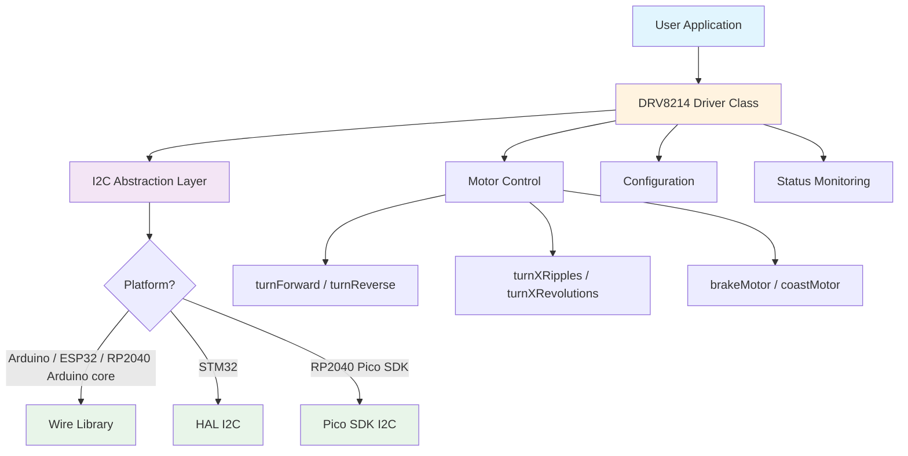
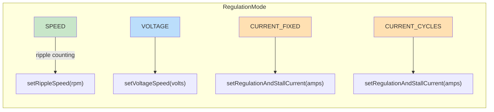

# DRV8214 Multiplatform Library

[](LICENSE.txt)
[](https://github.com/theohg/drv8214_multiplatform/releases)
[](https://github.com/theohg/drv8214_multiplatform/actions)


A C++ library for controlling the **[DRV8214](https://www.ti.com/product/DRV8214)** brushed DC motor driver from Texas Instruments via I2C. It supports Arduino, ESP32, STM32, and RP2040 targets and uses a per-instance bus handle so multiple buses or devices can be used without global transport state.

## Features

- **Multi-platform**: Single codebase for Arduino/ESP32 (Wire), STM32 (HAL), and RP2040
- **Bus-first design**: The active I2C bus is passed directly into the constructor
- **Regulation modes**: Speed (ripple counting), voltage, fixed current, cycle-by-cycle current
- **Motion control**: `turnForward`, `turnReverse`, `turnXRipples`, `turnXRevolutions`, `brakeMotor`, `coastMotor`
- **Sensorless position**: Ripple-counting with configurable thresholds and auto-stop
- **Monitoring**: Motor voltage, current, speed (RPM/rad/s), duty cycle, fault status
- **Protection**: Stall detection, overcurrent (OCP), overvoltage (OVP), thermal shutdown (TSD)

## Architecture


```mermaid
graph TD
    A[User Application] --> B[DRV8214 Driver Class]
    B --> C[I2C Abstraction Layer]
    C --> D{Platform?}
    D -->|Arduino / ESP32 / RP2040 Arduino core| E[Wire Library]
    D -->|STM32| F[HAL I2C]
    D -->|RP2040 Pico SDK| J[Pico SDK I2C]

    B --> G[Motor Control]
    B --> H[Configuration]
    B --> I[Status Monitoring]

    G --> G1[turnForward / turnReverse]
    G --> G2[turnXRipples / turnXRevolutions]
    G --> G3[brakeMotor / coastMotor]

    style A fill:#e1f5fe
    style B fill:#fff3e0
    style C fill:#f3e5f5
    style E fill:#e8f5e9
    style F fill:#e8f5e9
    style J fill:#e8f5e9
```

## Repository Layout

```text
include/
├──drv8214.h
├──drv8214_platform_config.h
├──drv8214_platform_i2c.h
src/
├──drv8214.cpp
├──drv8214_platform_i2c.cpp
examples/
├──basic_motor_control/
├──fault_monitoring/
.github/workflows/
  ci.yml
  release.yml
```

## Installation

### PlatformIO

Add to your `platformio.ini`:

```ini
lib_deps =
    https://github.com/theohg/drv8214_multiplatform.git#v1.1.0
```

### Arduino IDE

Download the repository or a release zip, then add it through Sketch -> Include Library -> Add .ZIP Library.

### STM32 HAL / Pico SDK

Copy `include/` and `src/` into your project, make sure the correct HAL or Pico SDK headers are available to the compiler, and keep I2C initialization in your application code.

## Usage Pattern

1. Initialize the I2C peripheral yourself.
2. Pass the active bus handle as constructor argument 1: `&Wire`, `&hi2c1`, `i2c0`, or `i2c1`.
3. Pass the 7-bit device address as constructor argument 2.
4. Call `init(...)` before using the driver.

For Arduino-based Pico builds, use `&Wire`. For pure Pico SDK builds, use `i2c0` or `i2c1` directly.

## Quick Start

### Arduino / ESP32 / RP2040 Arduino core

```cpp
#include <Wire.h>
#include <drv8214.h>

// Hardware parameters
#define I2C_ADDR          DRV8214_I2C_ADDR_00  // 0x30 (7-bit)
#define SENSE_RESISTOR    1000   // IPROPI resistor [Ohms]
#define RIPPLES_PER_REV   6      // Current ripples per rotor revolution
#define MOTOR_RESISTANCE  12     // Winding resistance [Ohms]
#define REDUCTION_RATIO   298    // Gearbox ratio
#define MAX_RPM           100    // Max motor RPM

DRV8214 motor(&Wire, I2C_ADDR, 0, SENSE_RESISTOR, RIPPLES_PER_REV,
              MOTOR_RESISTANCE, REDUCTION_RATIO, MAX_RPM);

void setup() {
    Serial.begin(115200);
    Wire.begin();

    motor.setDebugStream(&Serial);

    DRV8214_Config cfg;
    cfg.verbose = true;
    motor.init(cfg);
}

void loop() {
    // Turn forward for 5000 ripples, then stop
    motor.turnXRipples(5000, true, true);
    delay(3000);

    Serial.print("Speed: ");
    Serial.print(motor.getMotorSpeedShaftRPM());
    Serial.println(" RPM");

    motor.brakeMotor();
    delay(1000);
}
```

### STM32 HAL / Pico SDK

```cpp
#include "drv8214.h"

DRV8214 motor(&hi2c1, DRV8214_I2C_ADDR_00, 0, 1000, 6, 12, 298, 100);
// For a pure Pico SDK project, pass i2c0 or i2c1 instead of &hi2c1.

void app_init() {
    DRV8214_Config cfg;
    cfg.regulation_mode = VOLTAGE;
    cfg.voltage_range = true;
    motor.init(cfg);
}
```

## Functional Overview

### Regulation Modes


```mermaid
graph LR
    subgraph "RegulationMode"
        A[SPEED] -->|ripple counting| A1["setRippleSpeed(rpm)"]
        B[VOLTAGE] --> B1["setVoltageSpeed(volts)"]
        C[CURRENT_FIXED] --> C1["setRegulationAndStallCurrent(amps)"]
        D[CURRENT_CYCLES] --> D1["setRegulationAndStallCurrent(amps)"]
    end

    style A fill:#c8e6c9
    style B fill:#bbdefb
    style C fill:#ffe0b2
    style D fill:#ffe0b2
```

| Mode | Control Parameter | Use Case |
|------|-------------------|----------|
| `SPEED` | RPM via ripple counting | Closed-loop speed regulation |
| `VOLTAGE` | Terminal voltage [V] | Open-loop voltage drive |
| `CURRENT_FIXED` | Trip current [A] | Fixed off-time current limiting |
| `CURRENT_CYCLES` | Trip current [A] | Cycle-by-cycle current regulation |

> **Note**: In `CURRENT_FIXED` and `CURRENT_CYCLES` modes, speed and voltage are not I2C-controlled. The bridge applies the available supply according to the selected current behavior.

### Motion Helpers

| Helper | Purpose |
|--------|---------|
| `turnForward(...)` / `turnReverse(...)` | Continuous driving in the selected regulation mode |
| `turnXRipples(...)` | Move a measured number of rotor ripples with optional auto-stop |
| `turnXRevolutions(...)` | Move a measured number of output shaft revolutions |
| `brakeMotor()` / `coastMotor()` | Stop the motor with braking or Hi-Z behavior |

## API Overview

### Motor Control

| Method | Description |
|--------|-------------|
| `turnForward(speed, voltage, current)` | Drive forward; parameters depend on regulation mode |
| `turnReverse(speed, voltage, current)` | Drive in reverse; parameters depend on regulation mode |
| `brakeMotor()` | Apply active braking |
| `coastMotor()` | Coast / Hi-Z output stage |
| `turnXRipples(count, stops, dir, ...)` | Rotate for a target number of ripples |
| `turnXRevolutions(count, stops, dir, ...)` | Rotate for a target number of output shaft revolutions |

### Monitoring and Status

| Method | Returns |
|--------|---------|
| `getMotorSpeedRPM()` / `getMotorSpeedRAD()` | Rotor speed |
| `getMotorSpeedShaftRPM()` / `getMotorSpeedShaftRAD()` | Output shaft speed |
| `getMotorVoltage()` | Terminal voltage [V] |
| `getMotorCurrent()` | Motor current [A] |
| `getDutyCycle()` | Bridge duty cycle [0..100%] |
| `getRippleCount()` | 16-bit ripple counter |
| `getFaultStatus()` | Fault register byte |
| `printFaultStatus()` | Print decoded fault flags |

### Configuration

| Method | Description |
|--------|-------------|
| `init(cfg)` | Apply the startup configuration struct to the device |
| `setRegulationMode(...)` | Change the active control mode |
| `setVoltageSpeed(...)` | Set terminal voltage in voltage mode |
| `setRippleSpeed(...)` | Set the closed-loop ripple speed target |
| `setRegulationAndStallCurrent(...)` | Configure current limit and stall behavior |

## Examples

- `examples/basic_motor_control/basic_motor_control.ino`
- `examples/fault_monitoring/fault_monitoring.ino`

## Notes

- Device addresses are always 7-bit.
- For Arduino-based Pico builds, use `&Wire`; for pure Pico SDK builds, pass `i2c0` or `i2c1`.
- `setDebugStream()` is optional and mainly useful on Arduino-style targets.
- PlatformIO CI compiles the examples on Arduino Nano, ESP32, STM32, and RP2040.

## You Like This Library? See Also

- [BQ25756E Multiplatform](https://github.com/theohg/bq25756e_multiplatform)
- [INA228 Multiplatform](https://github.com/theohg/ina228_multiplatform)

## License

MIT License. See [LICENSE.txt](LICENSE.txt) for details.

Copyright (c) 2026 Theo Heng
